  

<h1 align="center">👋 Hola, soy Maximiliano | Hi, I'm Maximiliano</h1>

  <em>
    “Construyendo el futuro, una línea de código a la vez.”
     
    "Building the future, one line at a time."
  </em>

---

## 🧑‍💻 Sobre mí / About Me

🎓 Soy **Maximiliano Gómez**, analista y desarrollador de software con un enfoque fullstack.  
💼 Actualmente trabajo en **Soluque Informática** desarrollando soluciones web con Docker, React, Express y MariaDB.  
🚀 Me entusiasma explorar nuevas tecnologías y construir soluciones funcionales, eficientes y escalables.  

I'm **Maximiliano Gómez**, a software analyst and developer with a fullstack focus.  
Currently working at **Soluque Informática**, building web solutions with Docker, React, Express, and MariaDB.  
I'm passionate about exploring new technologies and creating efficient, scalable solutions.

---

 
   
   
   

## ⚙️ Tecnologías / Technologies & Tools

  
  
  
  
  
  
  
  
  
  
  
  
  
  
  
  
  
  
  
  
  
  
  
  

---

## 📦 Proyectos actuales / Ongoing Projects

### 🏞️ Uncovering History

Plataforma académica para explorar y gestionar espacios históricos y turísticos, con arquitectura distribuida.

Academic platform to explore and manage historical and tourist spaces, using a distributed architecture.

**Tecnologías:** Java 21 · Spring Boot · MongoDB · Docker · Flutter · Next.js

```mermaid
flowchart LR

subgraph Backend
    DB[(🗄️ Database)]
    API{🖥️ API}
end

subgraph Frontend
    Historian[📱 Historian App]
    Tourist[📱 Tourist App]
    Admin[🌐 Admin App]
end

DB --> API
API --> DB
   
API --> Admin & Tourist & Historian
Admin & Historian & Tourist --> API
```

📊 Arquitectura / Architecture

## 📈 GitHub Stats

 
   
   

